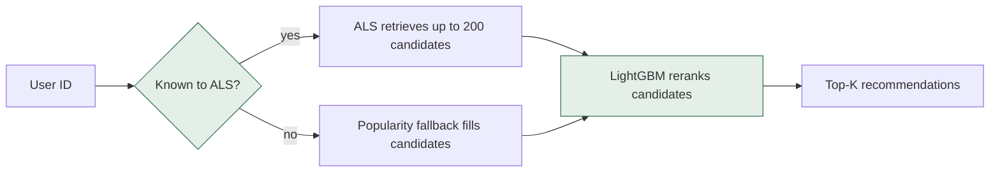

# Ecommerce Recommender

Three layers of recommendation, honestly evaluated on real e-commerce behavior.

## Outline

- [What this is](#what-this-is)
- [Architecture](#architecture)
- [Demo video](#demo-video)
- [Installation — users](#installation--users)
- [Installation — developers](#installation--developers)
- [Contributor expectations](#contributor-expectations)
- [Known issues](#known-issues)

## What this is

Give it a user ID, get back a ranked list of products that user is most
likely to want next — the "recommended for you" row behind every online
store. This repo builds that system in three layers of increasing
sophistication (a popularity baseline, ALS collaborative filtering, and
a two-stage retrieve-then-rerank model), all evaluated under a single,
strict, temporal protocol on the real
[Retailrocket e-commerce dataset](https://www.kaggle.com/datasets/retailrocket/ecommerce-dataset):
2,755,641 events (views, cart adds, purchases) from 1,407,580 users
across 235,061 items, May–September 2015.

The headline isn't the model, it's the evaluation. Every number below
is read directly from a committed file in `results/` — nothing here is
typed from memory or rounded optimistically.

**The honest result:** collaborative filtering (ALS) alone loses badly
to a plain popularity list — but only because 92.3% of test-period
users have zero training history, where ALS has nothing to work with.
For every user with any history at all, ALS actually beats the
baseline. The full two-stage model (ALS retrieve + LightGBM rerank)
is the only one of the three that performs reasonably across the
entire population, cold users included, and it's the only model that
beats the popularity baseline on every headline metric:

| Model | Recall@10 | Recall@20 | NDCG@10 | Coverage@10 | Pop-bias@10 |
|---|---|---|---|---|---|
| Popularity | 0.849% | 1.106% | 0.449% | 0.0077% | 0.9999 |
| ALS | 0.080% | 0.114% | 0.052% | 1.045% | 0.9958 |
| Two-stage | 0.964% | 1.318% | 0.618% | 2.412% | 0.9985 |

Full breakdown by cold-start segment, long-tail analysis, and a
side-by-side illustration of two real users are in
[`results/analysis.md`](results/analysis.md).

## Architecture



Stage 1 (retrieval) is fast and approximate: ALS matrix factorization
over confidence-weighted implicit feedback (view=1, cart=3,
purchase=5), padded with a popularity fallback so every user — known
or not — always gets a full candidate pool. Stage 2 (reranking) is
slower but only runs on ~200 candidates: a LightGBM binary classifier
trained on leakage-safe labels, using features stage 1 can't see
(item popularity trend, category affinity, recency, user activity).

## Demo video

*Video coming soon — recorded by the repository owner, link to be added here.*

## Installation — users

Run the API in Docker. No Python environment needed.

```bash
git clone https://github.com/hosnahatami04/ecommerce-recommender.git
cd ecommerce-recommender

# Download the dataset (free Kaggle account + API token required,
# or download manually -- see src/data/download.py for the fallback)
pip install kaggle
python -m src.data.download

# Train the serving model (takes ~15-20 minutes on CPU)
python -m src.eval.train_serving_model

# Build and run
docker build -t ecommerce-recommender .
docker run -p 8000:8000 ecommerce-recommender
```

Then:

```bash
curl http://localhost:8000/health
curl http://localhost:8000/recommend/1?k=10
```

Unknown users get a `fallback: true` response with popularity-based
recommendations instead of an error — see [Known issues](#known-issues).

## Installation — developers

```bash
git clone https://github.com/hosnahatami04/ecommerce-recommender.git
cd ecommerce-recommender

python -m venv .venv
.venv/Scripts/activate   # Windows; use `source .venv/bin/activate` on macOS/Linux
pip install -r requirements.txt

# Dataset (see Installation -- users above)
python -m src.data.download

make test    # pytest -q
make lint    # ruff check .
```

To retrain and re-run the full evaluation:

```bash
python -m src.eval.run_baseline          # Layer 1: popularity baseline
python -m src.eval.sweep_als             # Layer 2: ALS hyperparameter sweep (validation only)
python -m src.eval.run_als               # Layer 2: final ALS, evaluated on test once
python -m src.eval.run_two_stage         # Layer 3: full two-stage model, evaluated on test once
python -m src.eval.run_segment_analysis  # Cold-start / coverage / bias breakdown
python -m src.eval.train_serving_model   # Train the artifacts the API actually serves
python -m src.eval.benchmark_latency     # p50/p95 latency against a live model
```

Every script writes its results to `results/*.json`, committed to the
repo so every number in this README and in `results/analysis.md` is
reproducible and never hand-typed.

## Contributor expectations

- Every change goes through a feature branch and a pull request — no
  direct pushes to `main`.
- `pytest -q` and `ruff check .` must both pass before a PR is opened.
- CI re-checks both on every PR, plus a regression gate: if
  `results/baseline.json`'s recorded popularity Recall@10 drops below
  its recorded floor, CI fails (see `src/eval/check_regression.py`).
- Any change to the temporal split, event weights, or evaluation
  protocol must re-run the full evaluation pipeline and update the
  committed `results/*.json` files in the same PR — a metric claim
  that doesn't match a committed file is treated as a bug.

## Known issues

- **Cold-start users get no real personalization.** 92.3% of
  test-period users have zero training-period events. ALS scores
  exactly 0% Recall@10 for this group; the two-stage model's
  popularity fallback keeps it from collapsing to zero but is still
  fundamentally a non-personalized recommendation for these users.
  There is no way around this with behavioral data alone — see
  `results/analysis.md` for the full segment breakdown.
- **Absolute accuracy is low across every model.** Recall@10 tops out
  under 1% for all three layers. This is a real, honestly reported
  number driven by extreme catalog size (235,061 items) relative to
  typical per-user activity (median: 1 training event) — not a bug.
- **The `als_model.pkl` artifact is large (~876MB)** for the full
  1.4M-user, 128-factor model, which makes the Docker image
  content size ~1.12GB. This is the real cost of serving
  collaborative filtering at this user count on CPU with no
  approximate-nearest-neighbor index.
- **The category-affinity feature only covers items with a recorded
  `categoryid`** in the Retailrocket item-properties log (417,053
  items have one there, a separate and larger item population than
  the 235,061 items that appear in `events.csv`); items without a
  recorded category get a neutral (no-match) affinity score.
- **No approximate nearest-neighbor index for ALS retrieval.** At
  1.4M users this is still fast enough (p95 latency: 17.9ms per
  request, see `results/latency.json`), but wouldn't scale
  indefinitely without one.
